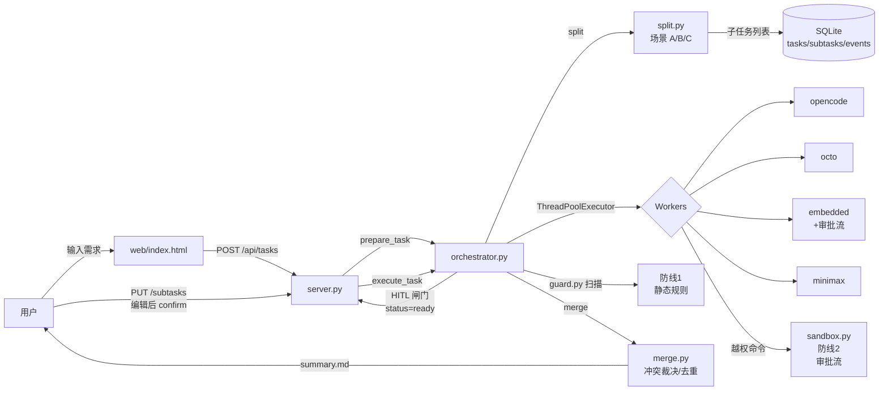

# 🎼 Maestro

**A Wallpaper-Native Multi-Agent Orchestrator — split long tasks, dispatch to workers, merge, all on your desktop.**

> *"Don't make one agent do everything. Make many agents do a little, then merge."*

[]()
[]()
[]()
[]()

---

## 这是什么？

**Maestro** 是一个**把多 Agent 编排器藏进桌面壁纸**的实验性项目：

- 🧠 **拆分-汇总（Map-Reduce）**：长任务拆成子任务、并行/串行派发给不同 worker、合并汇总
- 🛡️ **WorkBuddy 沙箱**：执行前 prompt 静态扫描 + 越权命令人工审批流（双层防线）
- 🎨 **Live2D 数字人**：桌面壁纸里的芙莉莲，陪你聊天 + 派任务
- 🔌 **多 Worker 注册**：OpenCode / Octo / Embedded / MiniMax 等即插即用
- 🗃️ **SQLite 状态机**：任务 / 子任务 / 事件 / 审批全部落库，断点续跑 + 全程可审计

---

## ✨ 5 个最值得说的设计

| # | 亮点 | 为什么重要 |
|---|---|---|
| 1 | **Orchestrator-Workers 完整状态机**（pending/ready/running/done/failed/retry/cancelled）| 业界 LangGraph / CrewAI / AutoGen 都是这个模式，Maestro 用 ~1400 行自己实现且无外部依赖 |
| 2 | **任务级人工闸门**（拆分后 stop at READY，等用户确认/编辑再 execute）| LangGraph 同样能力用 `interrupt_before`；Maestro 把它做成了一等公民 |
| 3 | **双层安全防线**（① guard.py 静态扫描外部 CLI prompt；② sandbox.py 越权命令审批流）| WorkBuddy 的核心模型：**默认受限 + 越权必须批准**。开源框架几乎没有对应实现 |
| 4 | **可插拔 Worker 协议**（`spawn(prompt, workdir, timeout, task_id, subtask_id) → WorkerResult`）| 加新 worker 只需继承 `SubprocessWorker` + 实现 `build_command` |
| 5 | **架构图状态可视化**（WebSocket 实时推送 + Mermaid 状态机）| 任务进度全可观测，不用 SSH 上服务器查 SQLite |

---

## 🚀 一键启动

```bash
# 1. 装依赖
pip install -r requirements.txt

# 2. 配 .env（DeepSeek + MiniMax keys）
cp .env.example .env
# 编辑 .env，至少填 DEEPSEEK_API_KEY

# 3. 起服务
cd src && python -m maestro.server
# → 浏览器打开 http://127.0.0.1:8787
```

**进阶**：Docker 启动、可观测面板、Tailwind UI 详见 [QUICKSTART.md](docs/QUICKSTART.md)。

---

## 📸 截图

> ⚠️ 占位——Frieren 壁纸 + 桌宠截图待补

| 首页（芙莉莲壁纸 + 输入框） | 任务窗口（WebSocket 实时进度） |
|---|---|
| `` | `` |

---

## 🏗️ 架构（5 分钟看懂）



**数据流**：用户 prompt → 拆分 → 入库 → **闸门** → 派发 → Worker 执行 → 合并 → 结果回推。

详见 [ARCHITECTURE.md](docs/ARCHITECTURE.md)（模块依赖、状态机、与 LangGraph 对比）。

---

## 🧪 跑测试

```bash
pytest tests/ -q                           # 132 测试
pytest tests/ --cov=src --cov-report=term  # 覆盖率
```

---

## 🗂️ 项目结构

```
Maestro/
├── src/maestro/                # 后端核心（~1400 行）
│   ├── orchestrator.py         # Orchestrator-Workers 调度
│   ├── split.py                # 拆分（A/B/C/auto 四场景）
│   ├── merge.py                # 汇总 + 冲突裁决
│   ├── workers/                # 可插拔 worker 池
│   │   ├── base.py             # SubprocessWorker 协议
│   │   ├── embedded.py         # 进程内 DeepSeek + 工具
│   │   ├── opencode.py         # E:\tools\opencode
│   │   ├── octo.py             # E:\tools\octo
│   │   └── minimax.py          # mmx CLI（文本/图片/视频/语音/音乐）
│   ├── sandbox.py              # WorkBuddy 沙箱：审批中心
│   ├── guard.py                # 防线 1：静态规则扫描
│   ├── db.py                   # SQLite 状态层
│   ├── server.py               # FastAPI + WebSocket
│   ├── chat.py                 # 数字人闲聊（含流式）
│   └── llm.py                  # 多 provider（DeepSeek/Kimi/Anthropic）
├── web/                        # 前端
│   ├── index.html              # 芙莉莲壁纸 1:1 复刻 + 输入框
│   └── pet_rig/                # 桌宠 PSD 切层 + 16 层骨架
├── wallpaper/                  # 壁纸资源
│   └── models/
│       ├── frieren/            # 芙莉莲切层
│       └── live2d/             # Live2D 桌宠（备份）
├── tests/                      # 132 测试
├── docs/
│   ├── ARCHITECTURE.md         # 架构详解
│   ├── QUICKSTART.md           # 3 步启动
│   ├── PRE_PUSH_CHECKLIST.md   # 推前检查
│   ├── LANGGRAPH_BORROW.md     # 借鉴 LangGraph supervisor 设计
│   └── 多Agent编排中文精读.md   # 多 Agent 编排论文精读
├── .github/workflows/ci.yml    # GitHub Actions
├── pyproject.toml              # ruff + mypy + pytest
└── requirements.txt
```

---

## 🛠️ 路线图

- **P1** ✅ Orchestrator + Workers + 拆分/汇总基础
- **P2** ✅ Web UI + 任务窗口 + 多 worker 注册
- **P3** 🚧 壁纸层 / 数字人（Live2D / PSD 切层骨架）
- **P4** 📅 语音口型同步
- **P5** 📅 多模态扩展（视觉 / 视频）
- **P6** 📅 商业化（个人作品 → SaaS）

---

## 🤝 贡献

提交 PR 前请读 [PRE_PUSH_CHECKLIST.md](docs/PRE_PUSH_CHECKLIST.md)：
1. 工作树干净（`git status`）
2. 密钥扫描（`git grep "sk-[A-Za-z0-9_-]{20,}"`）
3. 历史扫描（`git log --all -p | grep key`）
4. `.gitignore` 覆盖
5. 远程同步状态
6. **测试通过**（`pytest tests/`）

---

## 📜 许可证

MIT

---

## 🙏 致谢

- **LangGraph** 的 state machine + supervisor 设计哲学
- **WorkBuddy** 沙箱的"默认受限 + 越权审批"模型
- **Cubism** Live2D SDK
- **芙莉莲**——陪我写代码的伙伴