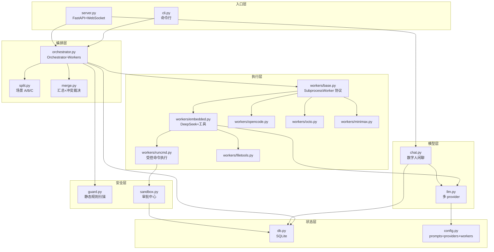
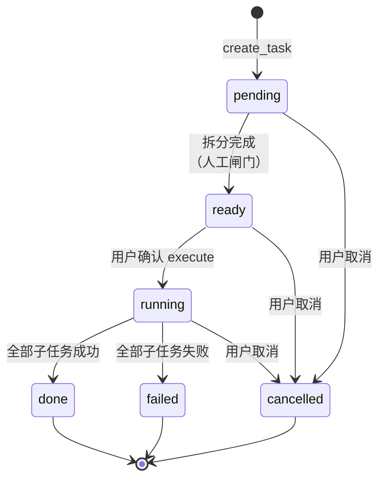
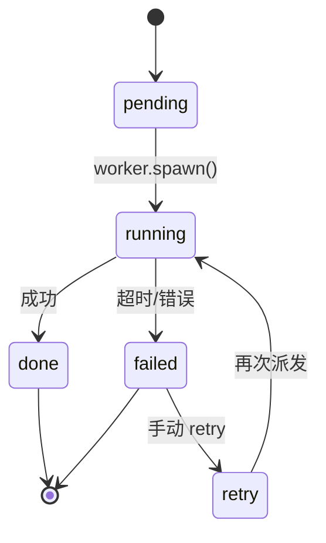

# Architecture

> 给面试官 / 二次开发者的一份——5 分钟理解 Maestro 的核心设计。

---

## 一、设计原则

| 原则 | 体现 |
|---|---|
| **YAGNI** | 只做 Orchestrator + Workers + 拆分/汇总，不做 DAG、不做 Agent DAG 引擎 |
| **Ponytail（极简）** | 1300 行核心代码实现完整编排，无外部 Agent 框架依赖（只用 FastAPI + httpx + sqlite3）|
| **WorkBuddy 沙箱** | 默认受限 + 越权必须用户批准——双层防线（guard + sandbox）|
| **状态机** | 任务/子任务/事件/审批全部 SQLite 落库，断点续跑 + 全程可审计 |
| **可插拔** | Worker 协议统一 `spawn(prompt, workdir, timeout, task_id, subtask_id) → WorkerResult`，加新 worker 只需 30 行 |

---

## 二、模块依赖图



**依赖倒置**：Orchestrator 只依赖 `workers.base.SubprocessWorker` 抽象协议，不直接 know 具体 worker 实现。

---

## 三、状态机

### 任务状态机



### 子任务状态机



---

## 四、关键数据流

### 场景 A：多需求逐个串行

```
用户: "加登录\n加支付\n加报表"
  ↓
split.split_requirements() → [t1, t2, t3]
  ↓
db.add_subtasks() → tasks[t1=pending, t2=pending, t3=pending]
  ↓
prepare_task → 任务 status=ready（HITL 闸门）
  ↓
execute_task → 串行执行
  ├─ _execute_subtask(t1)
  │    ├─ guard.scan(t1.desc) → ok
  │    ├─ worker.spawn(t1) → result.md
  │    └─ db.set_subtask_output(t1, done, output)
  ├─ _execute_subtask(t2)   ← 检查 _is_cancelled?
  └─ _execute_subtask(t3)
  ↓
db.set_task_status(done) → 写 summary.md
```

### 场景 B：长内容并行汇总

```
用户: 5 段长文本
  ↓
split.split_document() → [s1..s5] 各子任务读一段
  ↓
parallel = True → ThreadPoolExecutor(max_workers=min(8, 5))
  ├─ _execute_subtask(s1)  ← 同时跑
  ├─ _execute_subtask(s2)
  ├─ ...
  └─ as_completed → 检查 _is_cancelled 及时 break
  ↓
merge.merge([s1..s5]) → LLM 汇总
  ├─ _build_context: 用唯一 UUID 包裹子任务数据防 escape
  ├─ LLM JSON 输出: {summary, conflicts, duplicates, coverage_gaps}
  └─ _render_summary() → summary.md
```

### 场景 C：AI 智能拆分

```
用户: "实现订单系统"
  ↓
split.detect_scenario() → 路由到 c
  ↓
split.split_plan() → LLM 拆成结构化步骤
  ↓
与场景 B 相同的并行 + 汇总
```

---

## 五、双层安全防线

```
┌────────────────────────────────────────────────────────┐
│ 防线 1：guard.py（外部 CLI 派发前）                       │
│                                                          │
│   worker_type ∈ {opencode, octo, minimax}:              │
│     guard.scan(pdesc) → ok | warn | block              │
│     - block = 拦截子任务（高危指令：删盘/格式化/关机等）│   │
│     - warn = 写日志，不拦截                              │
│                                                          │
│   worker_type = embedded: 不重复扫描                     │
│     (有 runcmd 三档分级 + sandbox 审批流兜底)             │
└────────────────────────────────────────────────────────┘
                           ↓
┌────────────────────────────────────────────────────────┐
│ 防线 2：sandbox.py（embedded 执行命令时）                 │
│                                                          │
│   runcmd.validate(cmd):                                  │
│     - ALLOWED  → 直接执行（白名单只读命令）              │
│     - APPROVAL → 进审批队列（写/改/删/安装类）           │
│     - BLOCKED  → 拒绝（灾难性/命令链逃逸）               │
│                                                          │
│   sandbox.request_approval(cmd, task_id)                 │
│     - 阻塞 worker 线程，Event.wait()                     │
│     - 用户通过 server API 决定 approve/reject           │
│     - 超时（默认 120s）→ timedout，放弃执行              │
└────────────────────────────────────────────────────────┘
```

**为什么是两层**：外部 CLI 是黑盒 agent（无法约束单步），必须前置静态规则；embedded 在进程内，可精细控制每条命令，审批粒度更细。

---

## 六、关键设计权衡

### 1. 不用 LangGraph / CrewAI 自己写
- **理由**：1300 行实现完整编排 + 状态机 + 沙箱，无外部 Agent 框架依赖
- **代价**：没有"开箱即用"的工具库（如 LangChain 的 200+ 工具）
- **结论**：单 Agent 框架足够时别引第三方；引入 LangGraph 是因为 worker 数量 > 10 时再考虑

### 2. SQLite 不上 PostgreSQL
- **理由**：单机工具，SQLite 足够；零运维、零依赖、文件级备份
- **代价**：并发写有锁（已用 WAL + busy_timeout=5s 缓解）
- **结论**：上云时才考虑 Postgres

### 3. Worker 用 subprocess 不嵌入
- **理由**：环境隔离、worker 崩溃不影响编排器、可独立升级
- **代价**：每次 spawn 要加载 Python/Node 上下文
- **结论**：网络/磁盘/CPU 密集型 worker 必须进程隔离

### 4. 用 tool-calling 而非 function calling
- **理由**：tool calling 给 LLM 更多"上下文工程"控制（每个 tool 自己描述）
- **结论**：LangChain 2025 已转推荐 tool approach

### 5. 闸门放在拆分后不放在执行前
- **理由**：拆分成本最低，用户确认子任务列表只需几秒；如果每个子任务都审批，UX 疲劳
- **结论**：任务级 HITL > 决策级 HITL（除非高危场景）

---

## 七、与主流框架对比

| 维度 | Maestro | LangGraph | CrewAI | AutoGen |
|---|---|---|---|---|
| 代码量 | 1300 行核心 | 几十万行 | 几万行 | 几万行 |
| 外部依赖 | 仅 FastAPI + sqlite3 | LangChain 全家桶 | LangChain | pyautogen |
| 状态持久化 | ✅ SQLite | ✅ Checkpoint | ❌ 需自己实现 | ❌ 需自己实现 |
| 人工闸门 | ✅ 一等公民（prepare_task → READY）| ✅ interrupt_before | ❌ 无 | ❌ 无 |
| 多 Worker 协议 | ✅ SubprocessWorker | ⚠️ Node | ✅ Agent | ✅ Agent |
| 安全沙箱 | ✅ 双层（guard+sandbox）| ❌ 无 | ❌ 无 | ❌ 无 |
| 嵌套 supervisor | ❌ 一层 | ✅ 任意层 | ⚠️ Process.hierarchical | ✅ GroupChat |
| 长期 store | ❌ 仅 user_profile | ✅ Store | ❌ | ❌ |
| 数字人/UI | ✅ Live2D + 桌宠 | ❌ | ❌ | ❌ |

**Maestro 的差异化**：极简 + 沙箱 + 数字人。详见 [LANGGRAPH_BORROW.md](LANGGRAPH_BORROW.md)。

---

## 八、未来扩展点

| 优先级 | 扩展 | 价值 |
|---|---|---|
| 高 | `output_mode`（last_message / full_history）控制汇总 LLM context | 30 行 / 防 token 爆炸 |
| 高 | pre-model hook 长消息截断 | 50 行 / 防 context 爆炸 |
| 中 | post-model hook 守门人 | 100 行 / 决策合理性校验 |
| 中 | checkpoint 抽象 | 300+ 行 / 节点级断点恢复 |
| 中 | 跨任务 Store | 200+ 行 / agent 经验共享 |
| 低 | 嵌套 supervisor | 200+ 行 / 团队化任务 |
| 低 | 完整 LLM 决策路由 | 风险高 / 等 worker > 10 再做 |

---

## 九、参考资料

- [LangGraph supervisor](https://github.com/langchain-ai/langgraph-supervisor-py)
- [多 Agent 编排中文精读](多Agent编排中文精读.md)
- [技术方案](技术方案.md)
- [需求文档](需求文档.md)