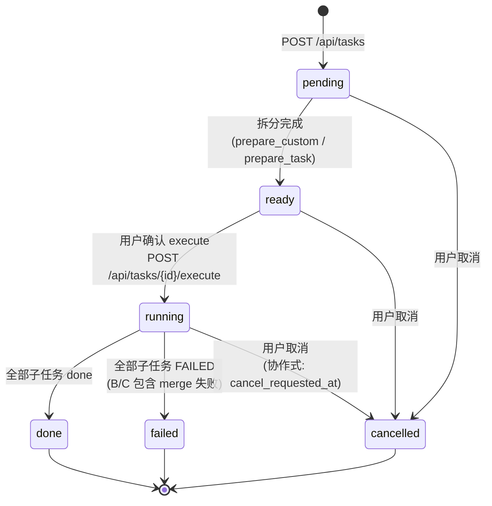

# 任务状态机（task state machine）

7 个状态：pending → ready → running → done / failed / cancelled。所有转换落 SQLite，`tasks.status` 列 + `task_events` 事件流（断点续跑 + 全程可审计）。

## 关键转换的代码位置

| 转换 | 函数 / 端点 |
|---|---|
| pending → ready | `orchestrator.prepare_task` / `prepare_custom`（用户工作流） |
| ready → running | `POST /api/tasks/{id}/execute` 提交到 slow 线程池 |
| running → done | 子任务全部 done（`status='done'`）且合并/审计成功 |
| running → failed | 子任务全部 FAILED 或 merge 失败 |
| 任意非终态 → cancelled | `POST /api/tasks/{id}/cancel`，写 `cancel_requested_at` 触发协作式取消 |

## 重试与恢复

- **子任务失败** → `retry` 状态可手动重派（`POST /api/tasks/{id}/retry/{sid}`），进入 running 循环
- **任务中断**（进程崩溃）→ `resume` 端点检测 `status='running'`，继续执行 pending 子任务
- **审批流影响** → `running` 中的子任务若触发 sandbox.request_approval 会**挂起**等用户决定（120s 超时返回 `timedout`）
