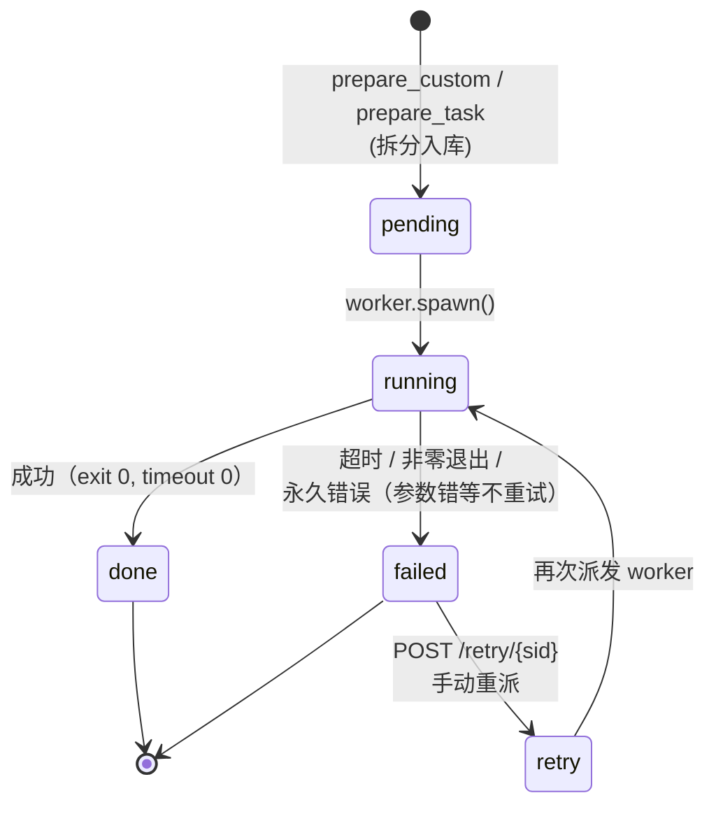

# 子任务状态机（subtask state machine）

子任务（subtasks 表）独立的 6 个状态。外加 retry 循环；执行中是嵌入式 LLM 调用 + 工具调用 + 审批流的中转站。



## retry 与永久失败的语义

- **`runcmd`**：仅 **瞬时故障** 重试（关键词匹配：timeout/connection/rate limit/429/5xx 等）；**永久失败**（bin 不存在、参数错误等）直接 FAILED 不重试，**避免重复计费**
- **`guard.scan`**：prompt 含恶意指令直接 block（不入 retry 循环，整任务 FAILED）
- **重试计数**：error 字段前缀 `[attempt N]`（仅用于审计）

## 嵌入式 worker 的子任务执行流（embedded 特殊）

```
running 状态内：
  ├─ guard.scan(desc) → ok | warn | block
  ├─ sandbox 工具调用（runcmd/filetools）：
  │    ├─ ALLOWED  → 直接执行
  │    ├─ APPROVAL → 挂起，等用户决定
  │    └─ BLOCKED  → 拒绝并标 failed
  └─ LLM 输出 → 子任务 output 落库
```

## 跨任务/环节的产出传递

工作流编排（`prepare_custom`）子任务带 `stage` 列（工作流环节序号）。执行时 `[[PREV_OUTPUT]]` 标记在 `_execute_subtask` 被替换为上一阶段所有已 done 子任务的 output 拼接（最近 3 个，4000 字上限），实现**环节间数据传递**。
