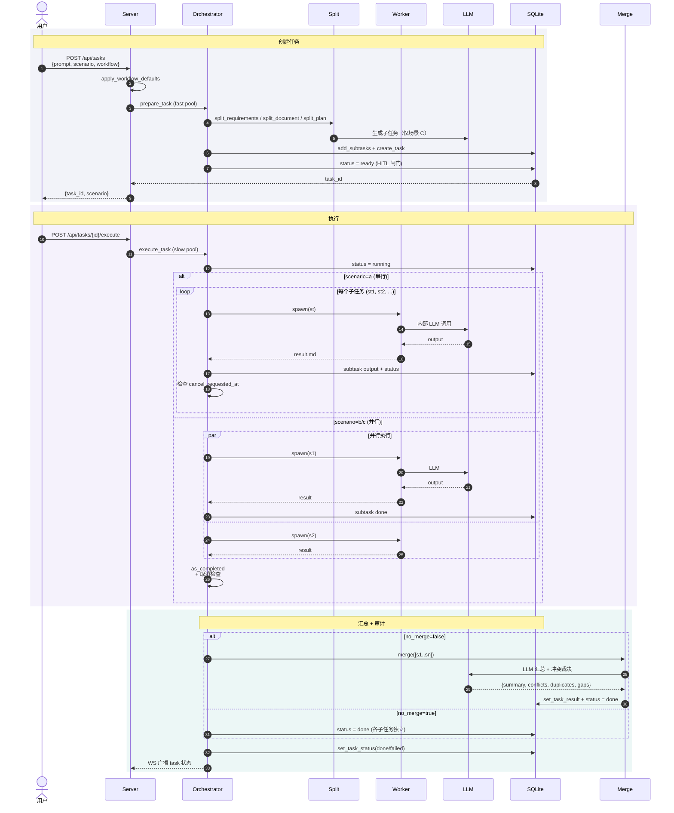

# 场景 A/B/C 数据流时序

三个场景共享同一执行骨架：`prepare → execute_task → merge`，区别只在**拆分阶段**和**汇总方式**。

## 关键差异

| 阶段 | 场景 A | 场景 B | 场景 C |
|---|---|---|---|
| **拆分** | 按换行切（无需 LLM） | 按段落数切（无需 LLM）| LLM 拆步骤（structured output）|
| **并行** | 否（串行，避免互相干扰） | 是（max 8 worker） | 是 |
| **汇总** | 无（no_merge=true 或各段独立） | LLM 汇总 + 冲突/重复/覆盖审计 | 同 B |
| **触发场景** | 多需求清单（"加登录\n加支付") | 长内容（多段文本） | 抽象任务（"实现订单系统"） |

## `auto` 模式

`POST /api/tasks` 的 scenario='auto' 先调 `split.detect_scenario()`（LLM 路由决策），结果 `task_id` 同普通任务。决策失败回退场景 A（`detect_reason` 写事件日志）。
